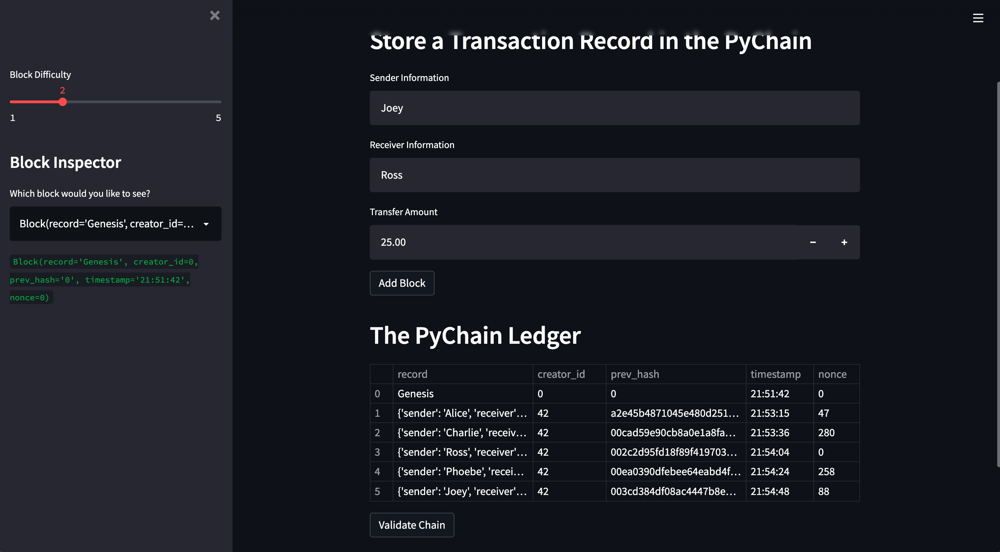
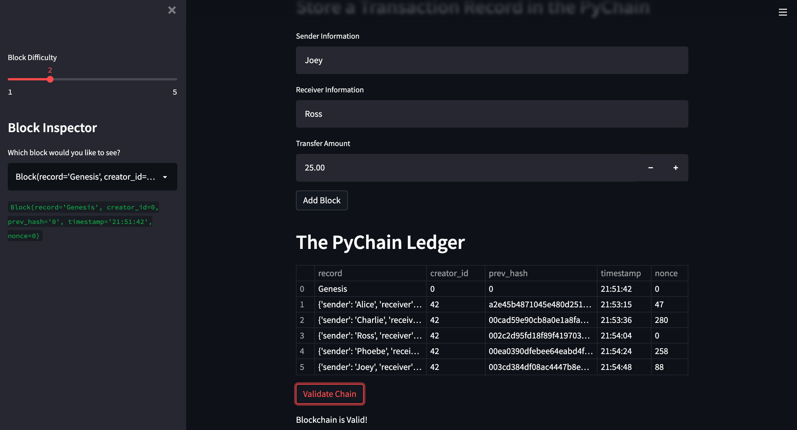

# Blockchain_Ledger_System

A Blockchain based ledger system with user-friendly web interface. This ledger system has two functionalities :

* Record Transactions between senders and receivers in the bloackchain ledger.

* Validates the Blockchain ledgger.

---

## Technologies Used

* [pandas](https://pypi.org/project/pandas/) - for analyzing data
* [streamlit](https://pypi.org/project/pandas/) - for analyzing data
* [hashlib]() -

---

## Installation Guide

```bash
pip install pandas
pip install streamlit

```

---

## Usage

Run the Streamlit application by using following command:

```bash
streamlit run pychain.py.

```

--

## Implementation

1) A Record data class is created which consists of the sender, receiver and the amount attributes.

2) Modified the exiting Block data class to store the Record class. An attribute named `record` of type `Record` data class is added.

3) Relevant User Inputs are added to the streamlit Interface. An additional input area for `sender`, `receiver` and `amount` are added.

4) As part of the Add Block button functionality, updated `new_block` so that Block consists of an attribute named `record`, which is set equal to a `Record` that contains the `sender`, `receiver`, and `amount` values.

5) Testing the PyChain Ledger by storing the multiple Records.

    

6) Testing the blockchain ledger by confirming that the blockchain is valid.

    
